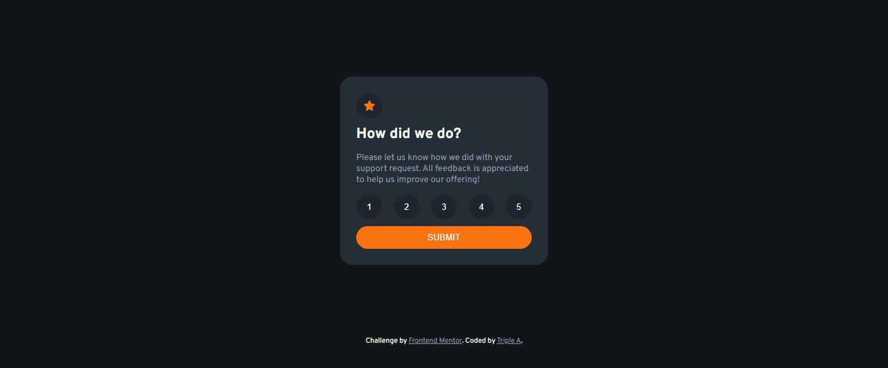
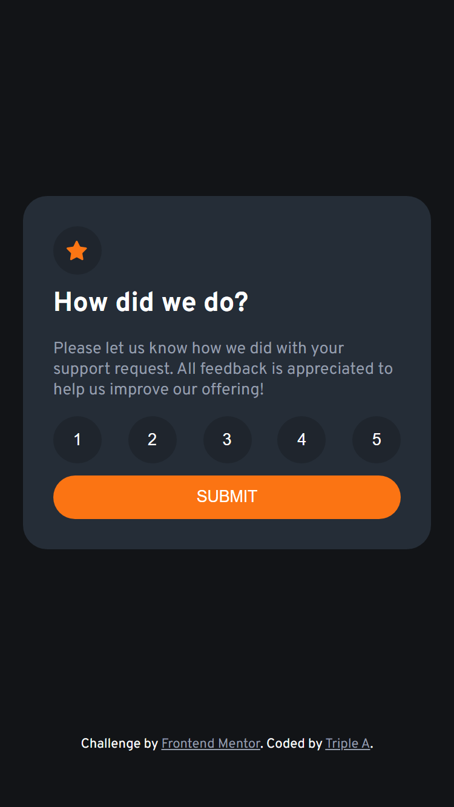

# Frontend Mentor - Interactive rating component solution

This is a solution to the [Interactive rating component challenge on Frontend Mentor](https://www.frontendmentor.io/challenges/interactive-rating-component-koxpeBUmI). Frontend Mentor challenges help you improve your coding skills by building realistic projects. 

## Table of contents

- [Overview](#overview)
  - [The challenge](#the-challenge)
  - [Screenshot](#screenshot)
  - [Links](#links)
- [My process](#my-process)
  - [Built with](#built-with)
  - [What I learned](#what-i-learned)
  - [Continued development](#continued-development)
- [Author](#author)

**Note: Delete this note and update the table of contents based on what sections you keep.**

## Overview
Interactive rating component that allows users to rate between one to five and display their rating in a thank you page.
### The challenge

Users should be able to:

- View the optimal layout for the app depending on their device's screen size
- See hover states for all interactive elements on the page
- Select and submit a number rating
- See the "Thank you" card state after submitting a rating

### Screenshot





### Links

- Solution URL: [Add solution URL here](https://github.com/TRIPLE-ADE/Interactive-rating-component)
- Live Site URL: [Add live site URL here](https://triple-ade.github.io/Interactive-rating-component/)

## My process
- Algorithm
- webpage structuring
- styling of webpages
- DOM manipulation
- storing of html tag in a variable
- using for each to select all rating buttons
- adding Event listener of click
- Saving the value of the clicked button in a variable
- Adding event listener of click to the submit button
- And display the thank you page when the submit button is clicked
- also display the content of the selected button on the thank you page

### Built with

- Semantic HTML5 markup
- CSS custom properties
- Flexbox
- javaScript custom properties
- JavaScript DOM Manipulation


### What I learned

Use this section to recap over some of your major learnings while working through this project. Writing these out and providing code samples of areas you want to highlight is a great way to reinforce your own knowledge.

To see how you can add code snippets, see below:

```html
<h1>Some HTML code I'm proud of</h1>
```
```css
.proud-of-this-css {
  color: papayawhip;
}
```
```js
//selecting the all the rating buttons using forEach 
document.querySelectorAll(".selected").forEach(e => {
    //adding an event listener to the rating button on click
    e.addEventListener('click', event => {
        //saving the content of the clicked button
        const savedValue = e.textContent  
        //adding event listeners to the submit button
        submit.addEventListener('click', function(){
            //displaying the content of the clicked button in 
            selectedRate.textContent = savedValue;
            rating.style.display = "none";
            thankYou.style.display = "block";

        })
    })
   
  })
```

### Continued development

Use this section to outline areas that you want to continue focusing on in future projects. These could be concepts you're still not completely comfortable with or techniques you found useful that you want to refine and perfect.

- Javascript DOM Manipulation
- function of JavaScript
- Array of JavaScript


## Author

- Website - [TRIPLE-TECH](https://triple-ade.github.io/Interactive-rating-component/)
- Frontend Mentor - [@TRIPLE-ADE](https://www.frontendmentor.io/profile/TRIPLE-ADE)
- Twitter - [@Triple123A](https://www.twitter.com/Triple123A)

